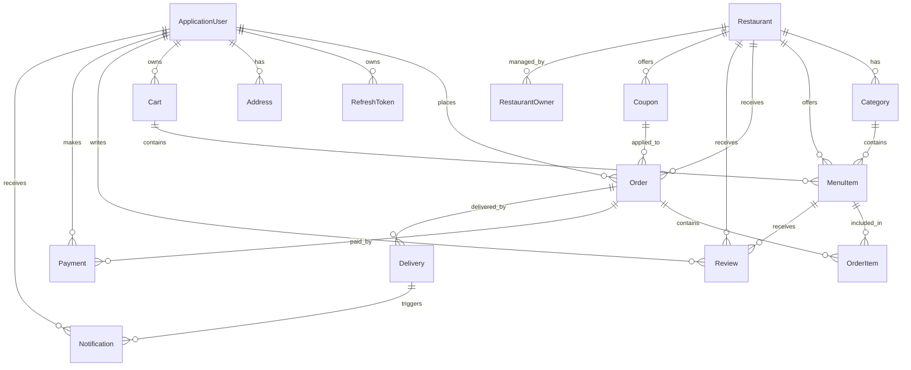

# FoodFlow 🍔 (.NET 9 Web API)

FoodFlow is a modern, scalable backend system for food delivery and restaurant management, inspired by platforms like UberEats. **This project is under active development and not yet production-ready.**

---

## 🚀 Project Vision

FoodFlow aims to provide a robust backend for food delivery platforms, enabling:

- Browsing restaurants and menus
- Placing and tracking orders in real-time
- Restaurant owner management for menus, categories, and orders
- Secure authentication and role-based access for both customers and restaurant owners

> **Note:** The project is still in progress and will continue to evolve towards a full-featured food delivery backend similar to UberEats.

---

## 🛡️ Professional API Features

FoodFlow is being built with all the essential modules and best practices required for a modern, enterprise-grade backend API. These features ensure security, maintainability, scalability, and developer productivity:

- **User Management**: Registration, authentication, roles, and permissions
- **Structured Logging** (Serilog): Centralized logs for monitoring and debugging
- **Exception & Error Handling**: Consistent error responses and global exception management
- **Problem Details Standardization**: RFC 7807-compliant error responses
- **CORS Configuration**: Secure cross-origin resource sharing
- **Audit Logging**: Track critical actions and changes
- **Background Jobs**: Scheduled and asynchronous tasks (e.g., Hangfire)
- **Caching**: In-memory or distributed caching for performance
- **Health Checks**: Endpoints for monitoring application and database health
- **Rate Limiting**: Protect APIs from abuse and ensure fair usage
- **API Versioning**: Seamless evolution of APIs
- **Swagger & OpenAPI Documentation**: Auto-generated, interactive API docs
- **Pagination, Filtering, and Sorting**: Efficient data access for large datasets
- **Account & Roles Management**: Admin features for managing users and permissions
- **Deployment Best Practices**: Guidelines for production readiness and CI/CD

> These features are either already implemented or planned for future releases, making FoodFlow a solid foundation for any real-world application.

---

## 🗄️ Database Design

### **Core Entities**

| Entity          | Description                                                        | Status      |
| --------------- | ------------------------------------------------------------------ | ----------- |
| ApplicationUser | Represents customers, restaurant owners, and admins.               | Implemented |
| Restaurant      | Stores restaurant details and settings.                            | Implemented |
| Category        | Menu categories (e.g., Pizza, Drinks) for each restaurant.         | Implemented |
| MenuItem        | Individual food/drink items offered by restaurants.                | Implemented |
| Order           | Customer orders, including status and delivery info.               | Implemented |
| OrderItem       | Items within an order (links MenuItem and Order).                  | Implemented |
| RefreshToken    | For secure session management.                                     | Implemented |
| Address         | User delivery addresses (multi-address support).                   | Planned     |
| Payment         | Payment records for orders (status, method, transaction info).     | Planned     |
| Review          | Customer reviews for restaurants and menu items.                   | Planned     |
| Cart            | User shopping cart (before placing order).                         | Planned     |
| Notification    | System/user notifications (order status, promos, etc.).            | Planned     |
| Delivery        | Delivery assignments and tracking (for couriers/drivers).          | Planned     |
| Coupon          | Discount codes and promotions.                                     | Planned     |
| RestaurantOwner | Links users to restaurants they manage (if multi-owner supported). | Planned     |

---

### **Entity Relationship Diagram (UberEats-like)**



---

### **Planned/Optional Entities**

- **Address:** For multi-address delivery support.
- **Payment:** For payment tracking and integration.
- **Review:** For user feedback and ratings.
- **Cart:** For pre-order item management.
- **Notification:** For user/system alerts.
- **Delivery:** For courier assignment and tracking.
- **Coupon:** For discounts and promotions.
- **RestaurantOwner:** For multi-owner restaurant management.

> **Note:** Not all entities are implemented yet. The project is evolving towards a full UberEats-like backend.  
> You can track progress in the [Roadmap](#roadmap) section.

---

## 📦 Project Structure

```
FoodFlow/
├── Controllers/
├── Entities/
├── Contracts/
├── Services/
├── Persistence/
├── Const/
├── Mapping/
├── Program.cs
├── appsettings.json
└── ...
```

---

## ⚡ Getting Started

1. **Clone the repository:**
   ```bash
   git clone https://github.com/OmarDiv/FoodFlow.git
   cd FoodFlow
   ```
2. **Configure your database connection:**
   - Edit `appsettings.json` with your SQL Server details.
3. **Restore dependencies:**
   ```bash
   dotnet restore
   ```
4. **Run EF Core migrations:**
   ```bash
   dotnet ef database update
   ```
5. **Start the API:**
   ```bash
   dotnet run
   ```
6. **Access API documentation:**
   - Browse to [https://localhost:5001/swagger](https://localhost:5001/swagger) for the interactive docs.

---

## 📝 Roadmap

- [x] Core entities and relationships
- [x] Authentication & JWT
- [x] Restaurant, menu, and order management
- [x] Refresh token support
- [x] API documentation
- [x] User management & roles
- [x] Logging & error handling
- [x] CORS, health checks, rate limiting
- [ ] Payment integration
- [ ] Real-time updates (SignalR)
- [ ] Unit & integration tests
- [ ] Docker support
- [ ] Advanced notifications
- [ ] Deployment best practices

---

## 🤝 Contributing

- Fork the repository and create feature branches.
- Follow .NET coding conventions and ensure code is well-documented.
- Write or extend unit/integration tests as needed.
- Submit clear and descriptive pull requests.

---

## 📄 License

This project is licensed under MIT.

---

## 📫 Contact

- **GitHub:** [OmarDiv](https://github.com/OmarDiv)
- **Email:** [Omaar88mohamed@example.com]

---

_FoodFlow is an independent backend project and not affiliated with UberEats or any other company._
